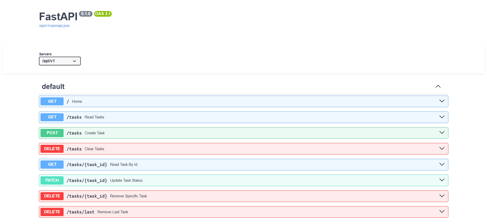

# FastAPI Task Manager API

A RESTful task management API built with FastAPI, SQLModel, and SQLite. This project allows users to create, retrieve, update, and delete tasks while demonstrating backend development concepts such as database integration, pagination, and request validation.

## Features

- Create tasks
- Read tasks (specific id, all tasks)
- Update tasks status (done / not done)
- Delete tasks (Specific id, all tasks, last task)
- SQLite database persistence
- Pagination support
- Input validation using Pydantic
- Interactive API documentation

## Tech Stack

### Backend
- Python
- FastAPI
- SQLModel
- Pydantic

### Database
- SQLite

### Tools
- Git
- Uvicorn


## Installation

### 1. Clone the repository:

```bash
git clone https://github.com/ramentopp/task-manager-api.git
cd task-manager-api
```

### 2. Create a virtual environment

```bash
python -m venv venv
```

### 3. Activate the virtual environment

Windows:

```bash
venv\Scripts\activate
```

Mac/Linux:

```bash
source venv/bin/activate
```

### 4. Install dependencies

```bash
pip install -r requirements.txt
```

### 5. Run the application

```bash
uvicorn app.routes:app --reload
```

The API will be available at:

```text
http://localhost:8000
```

Interactive API documentation:

```text
http://localhost:8000/docs
```

## API Endpoints

| Method | Endpoint | Description |
|----------|----------|----------|
| POST | /tasks | Create a task |
| GET | /tasks?offset={offset}&limit={limit} | Retrieve all tasks starting at offset, up to limit |
| GET | /tasks/{task_id} | Retrieve a specific task |
| PATCH | /tasks/{task_id} | Update task status |
| DELETE | /tasks/{task_id} | Delete a specific task |
| DELETE | /tasks/all | Delete all tasks |
| DELETE | /tasks/last | Delete the most recently created task |




## Skills Learned

- REST API design
- SQL databases and queries
- SQLite implementation with SQLModel
- API pagination techniques
- HTTP requests and JSON
- Pydantic Objects